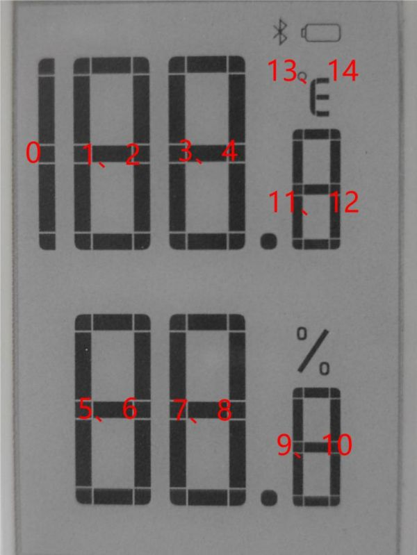

# Documentation

## Table of Contents

- [Documentation](#documentation)
  - [Table of Contents](#table-of-contents)
  - [Pixels definition](#pixels-definition)
  - [Segment Code Table](#segment-code-table)
    - [Number correspondence table](#number-correspondence-table)
    - [Precautions](#precautions)
  - [Specification and links](#specification-and-links)

## Pixels definition

## Segment Code Table

### Number correspondence table

Without decimal point.

| Digit | Bits                                                  |
| ----: | :---------------------------------------------------- |
|     0 | 0 x bf, 0 x 1f                                        |
|     1 | 0 x 1f (position 1), 0 x 00, 0 x 1f (other positions) |
|     2 | 0 x fd, 0 x 17                                        |
|     3 | 0 x f5, 0 x 1f                                        |
|     4 | 0 x 47, 0 x 1f                                        |
|     5 | 0 x f7, 0 x 1d                                        |
|     6 | 0 x ff, 0 x 1d                                        |
|     7 | 0 x 21, 0 x 1f                                        |
|     8 | 0 x ff, 0 x 1f                                        |
|     9 | 0 x f7, 0 x 1f                                        |

The decimal point and % are the 5th place in the 4th, 8th, and 10th positions respectively.
The 13th position can display Celsius (0 x 05) and Fahrenheit (0 x 06), the 0th position is the bottom line, the 1st position is the middle line, the 2nd position is other displays, the 3rd position shows the Bluetooth logo, and the 4th position Bit shows the power identification, number 14 is useless.

### Precautions

1. For the screen that supports partial refresh, please note that you cannot keep refreshing the screen partially when using it, you need to perform a full refresh on the screen after refreshing partially. Otherwise, the screen display effect will be abnormal and cannot be repaired!
2. Note that the screen cannot be powered on for a long time. When the screen is not refreshed, set the screen to sleep mode or power off. Otherwise, if the screen maintains a high voltage state for a long time, the screen will be damaged and cannot be repaired!
3. When using the ink screen, it is recommended that the refresh interval be at least 180s, and refresh at least every 24 hours. If the ink screen is not used for a long time, the ink screen should be clear and stored. (Refer to the datasheet for specific storage environment requirements.)
4. After the screen enters sleep mode, the image data sent will be ignored, and it can only be refreshed normally after re-initialization.
5. The working voltage requirement of the ink screen is 3.3V. If you buy a bare screen, if you need to match the 5V working environment when designing the circuit, it is recommended to do some level conversion processing. The new version (V2.1 and subsequent versions) has added a level processing circuit, which can support both 3.3V and 5V working environments. The old version can only support 3.3V working environments. You can confirm the version before using it. (The ones with 20-pin chips on the PCB are generally new versions.)
6. The FPC cable of the screen is relatively fragile, pay attention to bending the cable along the horizontal direction of the screen when using it, and not bending the cable along the vertical direction of the screen.
7. The screen of the ink screen is relatively fragile, so pay attention to avoid dropping, bumping, and pressing hard.
8. We recommend that customers use the sample program we provide and use the corresponding development board to test after getting the screen.

## Specification and links

- [Official wiki](https://www.waveshare.com/wiki/1.9inch_Segment_e-Paper_Module_Manual#Arduino)
- [Schematics](https://www.waveshare.com/w/upload/3/35/1.9inch_Segment_e-Paper_Module01.pdf)
- [Specification](https://www.waveshare.com/w/upload/b/bd/IST7134.pdf)
